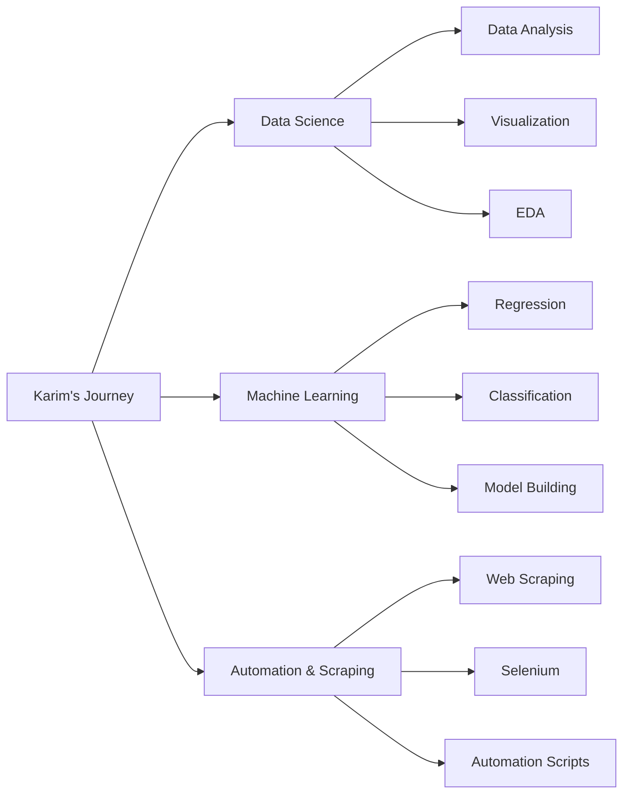

# Hi 👋, I'm Karim Hamada

### Data Scientist | Data Analyst | Automation Engineer | AI Enthusiast

---

I’m a Junior Data Scientist passionate about turning data into meaningful insights and intelligent solutions.

I work with Python, pandas, NumPy, and scikit-learn to build data-driven models and solve real-world problems. Recently, I’ve been exploring Generative AI and LLMs to enhance traditional workflows.

I enjoy learning, building projects, and sharing knowledge along the way.

---

## 🧠 Tech Stack (Data Science & Data Analysis)

### 📊 Data Analysis & Visualization

---

### 🤖 Machine Learning

---

### 🧾 Data Processing & NLP

---

### ⚙️ Tools & Environment

---

## 📊 GitHub Statistics

---

## 📈 Activity Graph

---

## 🎯 Current Focus

---

## 📈 Activity Graph

  

---

## 💡 Random Dev Quote

  
  

   

  <b style="color:#ff4d6d;">— Richard Hamming</b>

## 🤝 Let's Connect!

---

💌 Open to collaborations, freelance projects, and exciting opportunities!

---

⭐ Show some love by starring my repositories!

