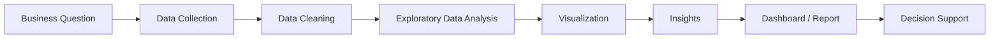
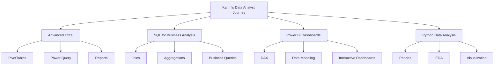

<!-- =========================
     Professional Data Analyst GitHub Profile README
     Updated for: Karim Hamada
     ========================= -->

# Hi 👋, I'm Karim Hamada  
### Data Analyst | BI Developer | Python & SQL Enthusiast | Turning Data Into Decisions

 

---

<table>
<tr>
<td width="62%" valign="top">

## 👨‍💻 About Me

I’m a **Junior Data Analyst** passionate about transforming raw data into clear insights, meaningful dashboards, and practical business recommendations.

I work with **Python, SQL, Excel, and Power BI** to clean, analyze, visualize, and explain data in a way that supports better decision-making.

My focus is not only writing code or creating charts, but also understanding the business question behind the data and presenting results in a simple, useful, and professional way.

### What I Do

- Clean and prepare messy datasets for analysis.
- Build interactive dashboards using Power BI.
- Analyze data using Python, Pandas, NumPy, and SQL.
- Create visual reports that explain trends and patterns.
- Turn data into insights that help people make smarter decisions.

</td>
<td width="38%" valign="top">

</td>
</tr>
</table>

---

## “Without data, you’re just another person with an opinion.”  
### — W. Edwards Deming

---

## 🧠 Core Data Analysis Skills

<table>
<tr>
<td width="33%" valign="top">

### 📊 Data Analysis

</td>
<td width="33%" valign="top">

### 📈 Visualization & BI

</td>
<td width="33%" valign="top">

### 🗄️ Databases

</td>
</tr>
</table>

---

## 🛠️ Tools & Technologies

### Programming & Analysis

### BI, Reporting & Spreadsheets

### Databases & Workflow

---

## 📌 Featured Data Projects

<table>
<tr>
<td width="50%" valign="top">

### 📊 Sales Performance Dashboard

A Power BI dashboard designed to track sales trends, KPIs, revenue performance, and product insights.

**Key Skills:** Power BI, DAX, Data Modeling, Dashboard Design  
**Value:** Helps stakeholders monitor performance and identify growth opportunities.

</td>
<td width="50%" valign="top">

### 🧹 Data Cleaning & EDA Project

A Python-based analysis project focused on cleaning messy datasets, handling missing values, detecting outliers, and extracting insights.

**Key Skills:** Python, Pandas, NumPy, Matplotlib, Seaborn  
**Value:** Converts raw data into a reliable format for analysis and reporting.

</td>
</tr>
<tr>
<td width="50%" valign="top">

### 🗄️ SQL Business Analysis

SQL queries for analyzing customers, orders, revenue, and business performance using relational databases.

**Key Skills:** SQL, MySQL, SQL Server, Joins, Aggregations  
**Value:** Answers business questions directly from structured databases.

</td>
<td width="50%" valign="top">

### 📈 Excel Reporting System

An Excel-based reporting solution using formulas, PivotTables, charts, and clean formatting.

**Key Skills:** Excel, PivotTables, Charts, Data Validation  
**Value:** Provides clear reports for quick decision-making.

</td>
</tr>
</table>

---

## 🔄 My Data Analysis Workflow

```mermaid
flowchart LR
    A[Business Question] --> B[Data Collection]
    B --> C[Data Cleaning]
    C --> D[Exploratory Data Analysis]
    D --> E[Visualization]
    E --> F[Insights]
    F --> G[Dashboard / Report]
    G --> H[Decision Support]
```

---

## 🎯 Current Focus

```mermaid
graph TD
    A[Karim's Data Analyst Journey] --> B[Advanced Excel]
    A --> C[SQL for Business Analysis]
    A --> D[Power BI Dashboards]
    A --> E[Python Data Analysis]

    B --> B1[PivotTables]
    B --> B2[Power Query]
    B --> B3[Reports]

    C --> C1[Joins]
    C --> C2[Aggregations]
    C --> C3[Business Queries]

    D --> D1[DAX]
    D --> D2[Data Modeling]
    D --> D3[Interactive Dashboards]

    E --> E1[Pandas]
    E --> E2[EDA]
    E --> E3[Visualization]
```

---

## 📊 GitHub Analytics

 
 

---

## 📈 Contribution Activity

---

## 🚀 Services I Can Help With

<table>
<tr>
<td width="25%" align="center">

### 📊 Dashboards
Power BI dashboards, KPI reports, and interactive business visuals.

</td>
<td width="25%" align="center">

### 🧹 Data Cleaning
Cleaning, formatting, preprocessing, and organizing raw datasets.

</td>
<td width="25%" align="center">

### 🗄️ SQL Analysis
Writing queries to extract, join, filter, and summarize business data.

</td>
<td width="25%" align="center">

### 📑 Excel Reports
Professional Excel sheets, PivotTables, charts, and reports.

</td>
</tr>
</table>

---

## 🤝 Let’s Connect

---

### 💌 Open to freelance projects, collaborations, internships, and data analysis opportunities.

### ⭐ If you like my work, consider starring my repositories.

